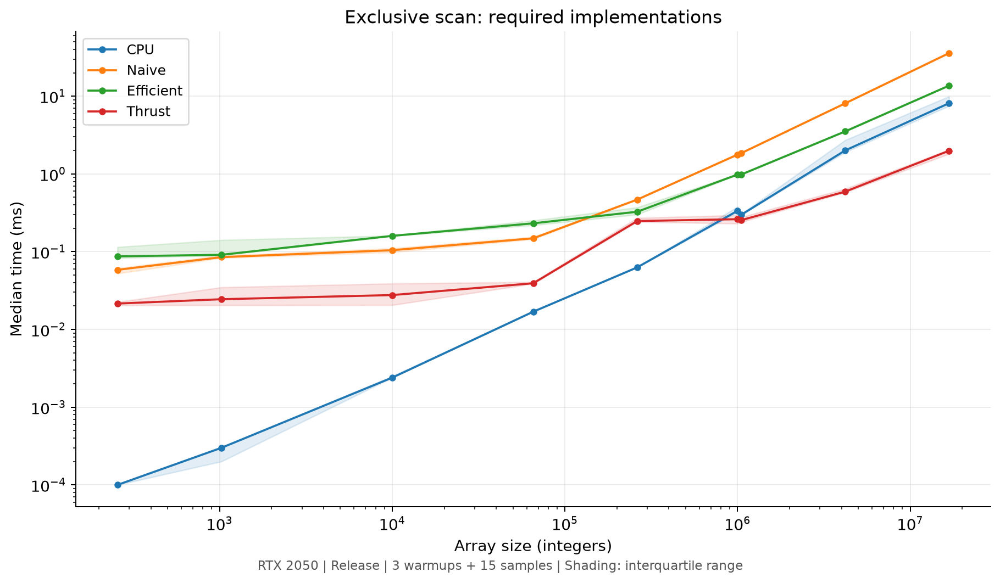
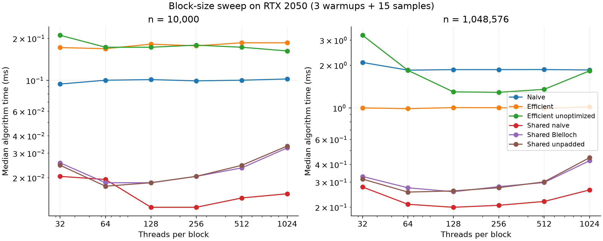
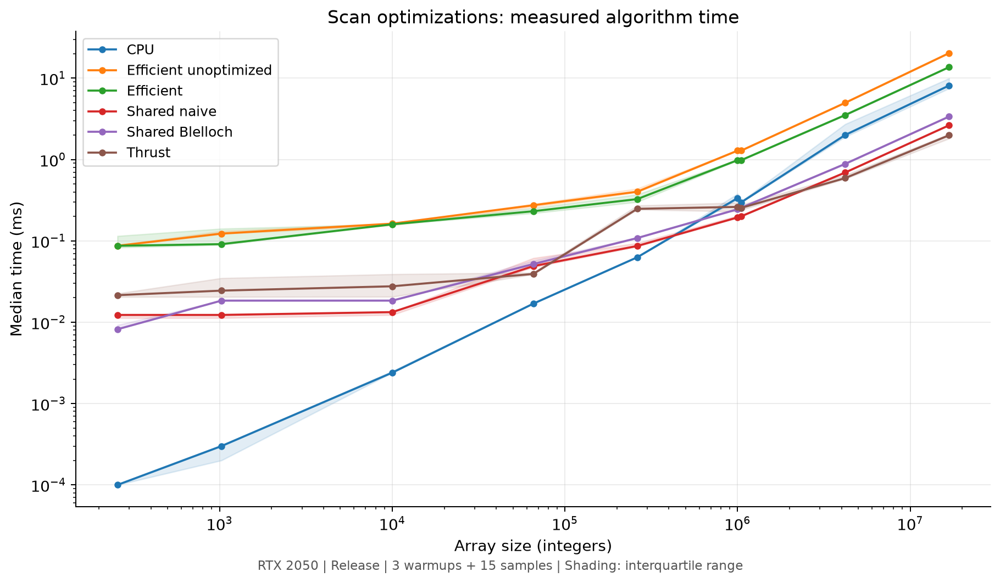
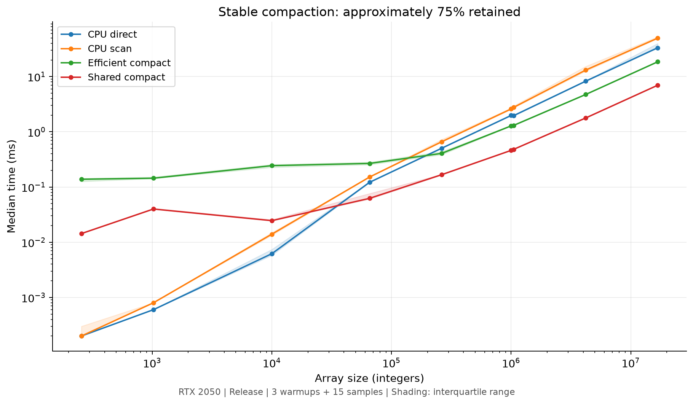
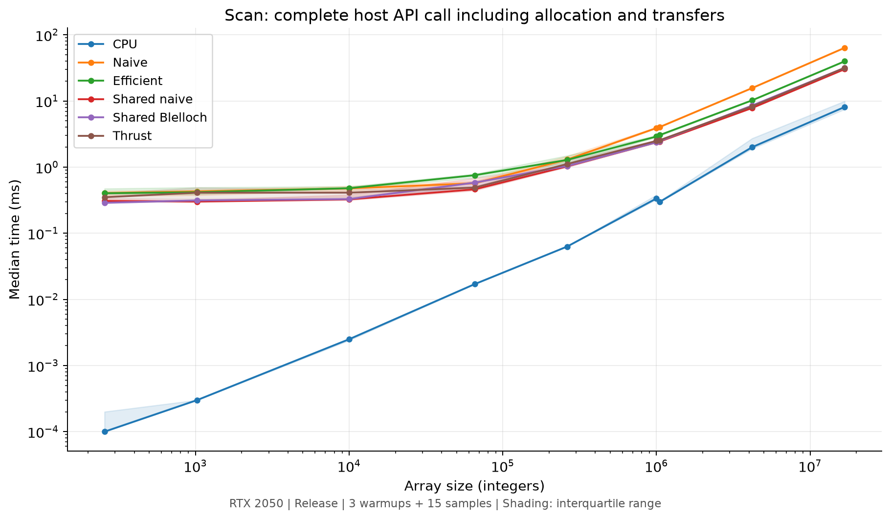
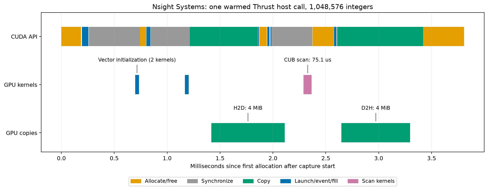

# CUDA Stream Compaction

University of Pennsylvania, CIS 5650: GPU Programming and Architecture, Project 2

<!-- (TODO) YOUR NAME HERE -->
- Chen Cheng
  <!-- (TODO) [LinkedIn](), [personal website](), [twitter](), etc. -->
  - [LinkedIn](https://www.linkedin.com/in/chen-andrew-cheng-34a133229/), [GitHub](https://github.com/ischencheng)
<!-- Tested on: (TODO) Windows 22, i7-2222 @ 2.22GHz 22GB, GTX 222 222MB (Moore 2222 Lab) -->
- Tested on: Windows 11 Home (10.0.26200), Intel Core i5-12500H (2.50 GHz base), 16 GB RAM,
  NVIDIA GeForce RTX 2050 Laptop GPU, 4096 MB, personal HONOR GLO-FX6P laptop.

<!-- (TODO: Your README) -->

This project implements exclusive prefix sums and stable removal of zero-valued
integers. It compares CPU scan, naive global-memory scan, Blelloch scan and Thrust.
Extra-credit implementations explore active-thread indexing, hierarchical shared
memory, and scan-based radix sort. Original TODO comments remain beside completed code.



## Features

| Implementation | Design | Work and auxiliary storage |
| --- | --- | --- |
| CPU scan | Serial exclusive prefix sum | O(n) work; O(1) storage |
| CPU direct compaction | Append each nonzero value | O(n) work; O(1) storage |
| CPU scan compaction | Map flags, scan, stable scatter | O(n) work and storage |
| Naive GPU scan | Ping-pong arrays at doubling offsets; shift to exclusive | O(n log n) work; O(n) storage |
| Work-efficient GPU scan | Pad to a power of two, up-sweep, clear root, down-sweep | O(n) useful work and storage |
| Thrust scan | `thrust::exclusive_scan` on device vectors | Library-managed scan and scratch |
| GPU compaction | Map flags, scan, scatter, return valid count | O(n) work and storage |
| Shared naive scan | Block-local ping-pong buffers; recursive block sums | O(n log B) work for tile size B |
| Shared Blelloch scan | Two elements/thread; recursive block sums; add offsets | O(n) work; dynamic shared memory |
| Radix sort | 32 stable binary partitions using shared scan | O(32n) work; O(n) storage |

For `[1, 5, 0, 1, 2, 0, 3]`, exclusive scan produces `[0, 1, 6, 6, 7, 9, 9]`,
while compaction produces `[1, 5, 1, 2, 3]`. Nonzero negatives are kept.
The valid length is `indices[n-1] + flags[n-1]`; only that output prefix is written.

Naive scan never reads a buffer being overwritten in the same pass. Blelloch
threads access disjoint tree nodes at each level, allowing in-place computation.
Same-stream launches order the levels. Shared scans use block barriers, including
threads that pad the last tile. CPU scan and CPU scan-compaction share an untimed
scan core to avoid nesting the public timer.

## Build and run

Tested with CUDA 13.0.48, driver 580.97, Visual Studio 2022 / MSVC 19.44.35215,
Windows SDK 10.0.26100.0, and CMake 3.30.0-rc3. GPU: SM 8.6, 16 SMs.
Measurements use **Release**, without a debugger or profiler attached.

From the repository root in PowerShell:

```powershell
cmake -S . -B build -G "Visual Studio 17 2022" -A x64 -T cuda=13.0
cmake --build build --config Release --parallel 4
ctest --test-dir build -C Release --output-on-failure
.\build\bin\Release\cis5650_stream_compaction_test.exe
.\build\bin\Release\cis5650_stream_compaction_test.exe --test
.\build\bin\Release\cis5650_stream_compaction_test.exe --radix-example
```

Select your installed CUDA toolset. For a Linux single-configuration generator,
use `cmake -S . -B build -DCMAKE_BUILD_TYPE=Release`, `cmake --build build`, then
`ctest --test-dir build --output-on-failure`. Linux execution was not tested.

**CMake changes beyond source lists:** added two CTest entries; aligned Windows
C++/CUDA with the static MSVC runtime to remove LNK4098; fixed the existing
`stream_compaction}` typo in the pre-3.23 branch. Added source/header entries for
validation, benchmarking, shared scans and radix sort.

Host APIs accept `0 <= n <= 2^30`, subject to memory availability. Empty input
permits null pointers; positive n requires valid host buffers. All scan intermediate
sums must fit signed 32-bit integers. Radix supports the full signed 32-bit range.
Block-size setters accept powers of two from 32 to 1024. Shared timers/settings
are intended for single-host-thread use.

## Measurement method and tuning

Seed 5650; integers uniformly selected from 0 through 3; approximately 75% retained
for compaction. Each configuration has three warmups and fifteen recorded samples.
Algorithm/block order is shuffled deterministically within each size. Graphs show
medians with interquartile bands. The smallest CPU times are near clock resolution;
they are not precise sub-microsecond throughput measurements.

CPU regions use `std::chrono`; GPU regions use CUDA events. Explicit allocation,
global-scan padding initialization, input upload and output download are excluded.
GPU compaction includes map, preparation of padded indices, scan and scatter;
count readback is excluded. Shared scans preallocate all recursion levels. Thrust
internal work stays inside its call. Events include gaps between queued work,
so these intervals are not the sum of kernel durations.

Full host-call wall time is also recorded, including allocation, transfers,
synchronization and cleanup. Laptop clock speeds and WDDM scheduling affect results.



The sweep tests 32, 64, 128, 256, 512 and 1024 threads at n = 10,000 and 1,048,576.
These settings minimize the median at the larger tuning size:

| Scan | Threads/block | Tuning median at 1,048,576 (ms) |
| --- | ---: | ---: |
| Naive global | 64 | 1.8477 |
| Work-efficient global | 64 | 0.9901 |
| Full-grid work-efficient baseline | 256 | 1.2896 |
| Shared naive | 128 | 0.2000 |
| Shared Blelloch, padded | 128 | 0.2573 |
| Shared Blelloch, unpadded | 64 | 0.2558 |

Thrust chooses its own configuration. Near-ties should not be overinterpreted.
Compaction reuses its scan's setting. Each algorithm keeps one setting across the
size comparison.

## Scan results and bottlenecks

| Algorithm | n = 256 (ms) | n = 1,048,576 (ms) | n = 16,777,216 (ms) |
| --- | ---: | ---: | ---: |
| CPU | 0.0001 | 0.2980 | 8.1212 |
| Naive global | 0.0584 | 1.8473 | 35.7882 |
| Work-efficient global | 0.0870 | 0.9815 | 13.6656 |
| Thrust | 0.0215 | 0.2543 | 1.9865 |
| Full-grid work-efficient baseline | 0.0870 | 1.2867 | 20.3217 |
| Shared naive | 0.0123 | 0.2003 | 2.6362 |
| Shared Blelloch, padded | 0.0082 | 0.2551 | 3.3755 |

CPU wins at small sizes: its contiguous serial loop has no GPU launch or
coordination cost. At large sizes, cache capacity, memory traffic and the dependent
prefix accumulator matter; timing alone does not isolate these costs.

Global naive scan rereads/rewrites the whole array each pass. Its O(n log n) traffic
and low arithmetic intensity explain poor large-array scaling. Coalescing cannot
remove repeated passes. Small arrays are dominated by launch/coordination overhead.

Work-efficient scan reduces useful additions to O(n), but launches
`2*ceil(log2(n))+1` kernels: 41 at n = 1,048,576. Near the root, most SMs have no
work; tree strides reduce useful data per transaction. Its 0.9815 ms still loses
to CPU 0.2980 ms. Fewer operations alone do not ensure better GPU utilization.

These are architectural explanations consistent with the code and measurements,
not measured bandwidth, bank-conflict counters or achieved occupancy.

## Extra credit: active-thread and shared-memory optimization



**Active threads (Part 5).** Launch only `padded/stride` threads and map t to
`(t+1)*stride-1`. `Efficient::scanUnoptimized` launches one thread per padded
element with a modulus test. Separately tuned versions improve from 1.2867 to
0.9815 ms (**1.31x**) at 1,048,576 and from 20.3217 to 13.6656 ms (**1.49x**) at
16,777,216. At the same 256-thread block, tuning shows 1.2896 versus 1.0051 ms at
1,048,576. Shrinking launches saves idle work but cannot create parallelism at the root.

**Shared memory (Part 6).** Both GPU Gems block algorithms are implemented: naive
double buffering and Blelloch up/down-sweep. Arbitrary sizes use tile scans,
recursive scans of tile totals, and uniform offset addition. With 128 threads,
Blelloch handles 256 elements/tile and needs five launches at 1,048,576 instead
of 41. Its 0.2551 ms is **3.85x** faster than the optimized global tree. At
16,777,216 it is **2.41x** faster than CPU in the algorithm region.

Shared naive beats shared Blelloch at larger tested sizes despite more additions.
For a small fixed tile those additions stay in shared memory and most lanes work;
Blelloch pays for two traversals, barriers, indexing and shrinking active lanes.
Asymptotic work alone cannot rank these finite-size implementations.

**Bank padding.** The tree maps i to `i + (i >> 5) + (i >> 10)` for 32 banks.
Two contiguous half-tile loads give adjacent lanes adjacent global addresses.
`scanUnpadded` preserves the same tree without padding. At 128 threads, padding
changes 0.2606 to 0.2573 ms at 1,048,576, only about 1.3%; at 1024 threads, 0.4467
to 0.4253 ms, about 4.8%. Some block sizes show no benefit. The main gain is the
hierarchical design; the sweep does not establish a universal padding speedup.

**Occupancy.** CUDA reports 100 KiB shared memory and 1536 resident threads/SM.
The padded kernel uses 1056 bytes/block at 128 threads, allowing 12 blocks/SM and
100% theoretical occupancy. At 32 threads the 16-block limit gives 33.3%; at 1024
threads only one block fits by thread count, giving 66.7%. See
[occupancy.txt](results/occupancy.txt). These bounds do not imply full achieved
occupancy at small sizes or upper recursion levels.

## Compaction and transfer costs



At 1,048,576, CPU direct compaction takes 1.9603 ms, CPU map/scan/scatter 2.7674 ms,
global GPU compaction 1.3060 ms and shared GPU compaction 0.4810 ms. Scan-based
compaction adds passes and temporary arrays. Direct CPU compaction uses fewer
passes but data-dependent branches. GPU scatter addresses are unique; no atomics
are needed, and order is preserved.



Shared scan's 0.2551 ms region becomes 2.4766 ms for the complete call at 1,048,576,
versus CPU 0.2980 ms. At 16,777,216, Thrust's 1.9865 ms region becomes 31.7072 ms
end to end, versus CPU 8.1216 ms. With a host-pointer interface, faster GPU kernels
do not guarantee a faster call. A path tracer benefits most from retaining arrays
on the GPU and reusing workspace; `Shared::scanDevice` demonstrates device-side
composition for compaction and radix sort.

## Extra credit: signed radix sort

`Radix::sort` makes 32 LSD passes. It scans zero-bit flags, scatters zeros to
their prefix counts and ones to `totalZeros + index - zeroPrefix`. Both groups
preserve order. `unsigned(value) ^ 0x80000000u` maps signed order to unsigned key
order, including `INT_MIN` and `INT_MAX`. All rounds reuse buffers and scratch;
there are no per-bit host transfers.

```cpp
#include <stream_compaction/radix.h>
int input[] = {4, -7, 2, 6, 3, -5, 1, 0};
int output[8];
StreamCompaction::Radix::sort(8, output, input);
// output: {-7, -5, 0, 1, 2, 3, 4, 6}
```

This demonstrates scan as a building block for stable partition and sorting.
It is a simple binary radix implementation without claiming to match a production
multi-bit sorter. Tests compare against `std::stable_sort`.

## Reproduce measurements

```powershell
.\build\bin\Release\cis5650_stream_compaction_test.exe --tune results\tuning.csv
.\build\bin\Release\cis5650_stream_compaction_test.exe --benchmark results\benchmark.csv
.\build\bin\Release\cis5650_stream_compaction_test.exe --occupancy
python -m pip install matplotlib
python scripts\plot_results.py
```

Raw CSV files contain every sample. The script regenerates figures and
[summary.csv](results/summary.csv). Validation runs outside timing regions.
Run benchmarks separately from profilers and sanitizers.

## Nsight Systems: inside the Thrust call



Nsight Systems 2025.5.1 captured one warmed call on 1,048,576 integers after three
warmups. The figure is drawn from actual exported CUDA API/kernel/copy timestamps;
the CSV is [thrust-timeline.csv](results/thrust-timeline.csv). The two device-vector
allocations, their fill kernels and the 4 MiB upload occur before the first timer
event is recorded. Between the two event-record API calls, the trace shows one
additional `cudaMalloc`, `DeviceScanInitKernel`, `DeviceScanKernel`, stream
synchronization and `cudaFree`. This supports the inference that this Thrust/CUB
path allocates temporary scan storage inside the call. The 4 MiB download and
vector cleanup follow the timed region.

The captured scan initialization and main kernels took 1.920 and 75.139 microseconds.
These instrumented durations are not the unprofiled benchmark's 0.2543 ms event
interval. API dispatch, synchronization, temporary allocation and scheduling gaps
make the interval different from pure kernel duration. The wrapper has two explicit
host/device transfers; there is no extra host/device array copy visible inside
`exclusive_scan`. [API summary](results/thrust-api.csv) and
[kernel summary](results/thrust-kernels.csv) preserve the evidence. The API summary
also includes about one second in `cudaProfilerStart`; this is capture setup and
is excluded from the figure and performance comparisons.

To reproduce, with `nsys` on PATH:

```powershell
nsys profile --trace=cuda --sample=none --cpuctxsw=none --capture-range=cudaProfilerApi --capture-range-end=stop --output=build/profiles/thrust .\build\bin\Release\cis5650_stream_compaction_test.exe --profile-thrust
nsys export --type=sqlite --output=build/profiles/thrust.sqlite build/profiles/thrust.nsys-rep
python scripts/plot_timeline.py build/profiles/thrust.sqlite
```

`python scripts/plot_timeline.py` without arguments redraws from the included CSV.

## Correctness and program output

The original starter tests are retained, seeded deterministically, and now return
a failing process exit code if a comparison fails. Additional tests use
`std::exclusive_scan`, `std::copy_if` and `std::stable_sort` as independent references.
They cover 175 shared input cases, lengths 0 through 1,048,579, all zeros, all ones,
negative/alternating values, random values, a nonzero final element, block boundaries,
non-power-of-two lengths, six block sizes, output guards and input preservation.
Radix has additional full signed-range random and `INT_MIN`/`INT_MAX` cases.

Compute Sanitizer 2025.3.0 passed the `--quick-test` subset (65 input cases, including
262,145 elements and all block sizes): [memcheck](results/memcheck.txt) reports zero
errors, [racecheck](results/racecheck.txt) zero hazards/errors/warnings, and
[synccheck](results/synccheck.txt) zero errors.

```powershell
compute-sanitizer --tool memcheck --error-exitcode 1 .\build\bin\Release\cis5650_stream_compaction_test.exe --quick-test
compute-sanitizer --tool racecheck --error-exitcode 1 .\build\bin\Release\cis5650_stream_compaction_test.exe --quick-test
compute-sanitizer --tool synccheck --error-exitcode 1 .\build\bin\Release\cis5650_stream_compaction_test.exe --quick-test
```

Actual starter, extended-test and radix-example output follows. These one-off
starter timings include cold calls and are not used for performance conclusions.

```text
****************
** SCAN TESTS **
****************
    [  39  11  17  27  46  35  15   4  39   9   1  20  34 ...  47   0 ]
==== cpu scan, power-of-two ====
   elapsed time: 0.0003ms    (std::chrono Measured)
    [   0  39  50  67  94 140 175 190 194 233 242 243 263 ... 6506 6553 ]
==== cpu scan, non-power-of-two ====
   elapsed time: 0.0001ms    (std::chrono Measured)
    [   0  39  50  67  94 140 175 190 194 233 242 243 263 ... 6404 6419 ]
    passed
==== naive scan, power-of-two ====
   elapsed time: 0.124928ms    (CUDA Measured)
    passed
==== naive scan, non-power-of-two ====
   elapsed time: 0.070656ms    (CUDA Measured)
    passed
==== work-efficient scan, power-of-two ====
   elapsed time: 0.24064ms    (CUDA Measured)
    passed
==== work-efficient scan, non-power-of-two ====
   elapsed time: 0.089824ms    (CUDA Measured)
    passed
==== thrust scan, power-of-two ====
   elapsed time: 0.183296ms    (CUDA Measured)
    passed
==== thrust scan, non-power-of-two ====
   elapsed time: 0.028416ms    (CUDA Measured)
    passed

*****************************
** STREAM COMPACTION TESTS **
*****************************
    [   2   1   3   2   1   2   3   3   0   0   2   1   0 ...   1   0 ]
==== cpu compact without scan, power-of-two ====
   elapsed time: 0.0006ms    (std::chrono Measured)
    [   2   1   3   2   1   2   3   3   2   1   3   1   1 ...   2   1 ]
    passed
==== cpu compact without scan, non-power-of-two ====
   elapsed time: 0.0003ms    (std::chrono Measured)
    [   2   1   3   2   1   2   3   3   2   1   3   1   1 ...   2   1 ]
    passed
==== cpu compact with scan ====
   elapsed time: 0.0009ms    (std::chrono Measured)
    [   2   1   3   2   1   2   3   3   2   1   3   1   1 ...   2   1 ]
    passed
==== work-efficient compact, power-of-two ====
   elapsed time: 0.224256ms    (CUDA Measured)
    passed
==== work-efficient compact, non-power-of-two ====
   elapsed time: 0.185568ms    (CUDA Measured)
    passed
PASS: radix signed extremes and random full-range keys; block sizes 32 through 1024.
PASS: 175 input cases; independent std::exclusive_scan and std::copy_if references.
PASS: empty/singleton, zero/one/signed/random/tail-only data, block boundaries, non-power-of-two sizes.
PASS: output guards and input preservation (CPU and GPU).
Radix input: 4 -7 2 6 3 -5 1 0
Radix output: -7 -5 0 1 2 3 4 6
```

## References

- [Project instructions](INSTRUCTION.md), corrected figures and examples.
- [3-Parallel-Algorithms, Fall 2026](https://docs.google.com/presentation/d/1KFcjS8fAorTxRLxAgDKFsPtzCu78oISx/edit): scan, compaction, radix split, hierarchical scan.
- [4-CUDA-Performance, Fall 2026](https://docs.google.com/presentation/d/1UF_kPHIQTvmLosWOSo-sXfUUEiIS6HcH/edit): warp partitioning, coalescing, banks, SM resources.
- [Project 2 recitation](https://docs.google.com/presentation/d/1a_X2CYA26_rKkicSG3Xc5pcvr1QaGBneEC-69VrfmoQ/edit).
- [GPU Gems 3, Chapter 39](https://developer.nvidia.com/gpugems/gpugems3/part-vi-gpu-computing/chapter-39-parallel-prefix-sum-scan-cuda) and [linked errata](https://github.com/CIS565-Fall-2017/Project2-Stream-Compaction/blob/master/INSTRUCTION.md#gpu-gem-3-ch-39-patch).
- [Thrust stream compaction](https://nvidia.github.io/cccl/thrust/api/group__stream__compaction.html), replacing the old linked URL. Optional `thrust::remove_if` compaction is not implemented.
